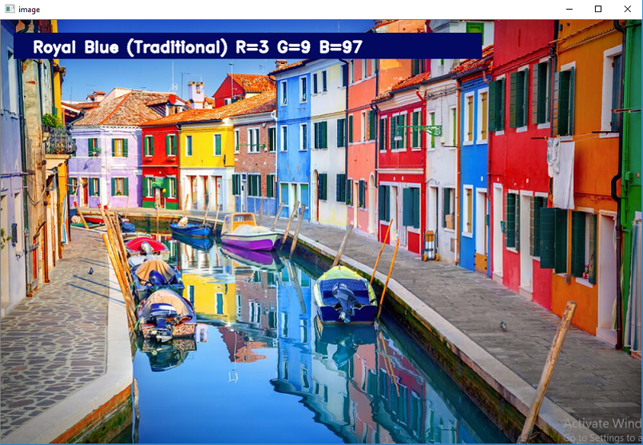

# Color Detection of RGB Images Using Python and OpenCV:

A color detection algorithm identifies pixels in an image that match a specified color or color range.

The extracted rgb values are then compared to a csv colors data sheet to select the matching color.

### How To Use Code :

---

Install All Dependencies :

- `pip install -r requirements.txt`

Replace line 5 with image path :

- `img_path = "sample.jpg"`

Run python code :

- `python main.py`

Finally Double Click To Select Area

### Preview :

---

